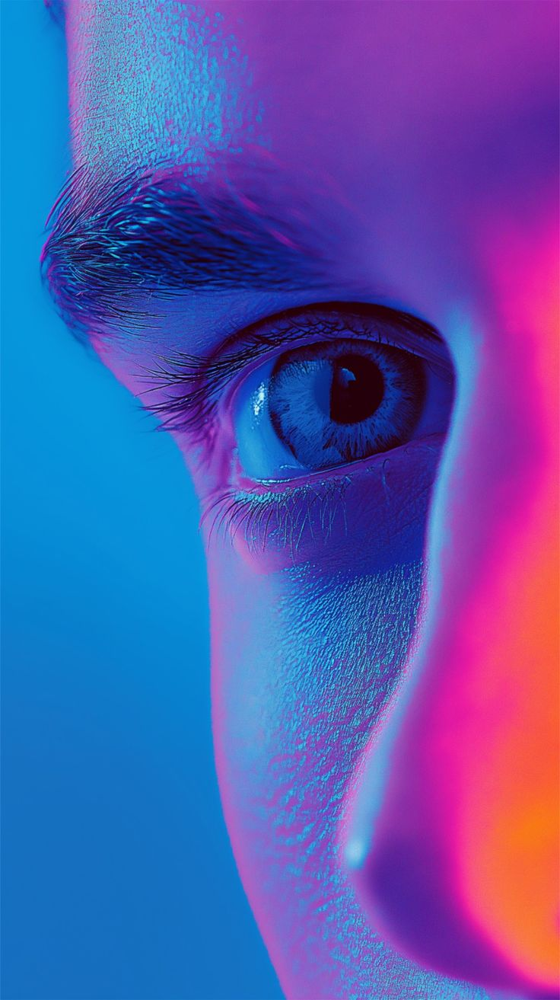

# 📸 LensNest - ArtView Gallery

A responsive image gallery with fullscreen lightbox and elegant UI, featuring a video background header and newsletter section.

## ✨ Features
- **Interactive Lightbox**: Fullscreen image viewing with navigation
- **Dynamic Layout**: Responsive masonry grid (2-4 columns)
- **Video Background**: Cinematic header with looped video
- **Newsletter Integration**: Dummy Email signup form
- **Mobile-Optimized**: Touch-friendly controls

## 🚀 Live Demo
🔗 **View it live**: [https://lensnest.netlify.app/](https://lensnest.netlify.app/)

## 🛠️ How to Use
1. Scroll through the gallery grid
2. Click any image to enter fullscreen mode
3. Use ← → arrows or swipe to navigate

## 📋 Code Structure
lensnest/
├── index.html # Gallery layout
├── style.css # Responsive grid & animations
├── script.js # Lightbox functionality
└── Assets/
├── video.mp4 # Header background
├── img-g-1.jpg # Gallery images (26 total)
└── icon-img.png # Favicon

## 🔧 Technologies Used
- **CSS Grid/Masonry** for responsive layout
- **HTML5 Video** for background
- **Vanilla JavaScript** for lightbox
- **RemixIcon/Boxicons** for UI elements
- **Media Queries** for mobile adaptation

## 📜 License
MIT License - Free to use and modify

---

Created as part of the **Code Alpha Internship Program**
